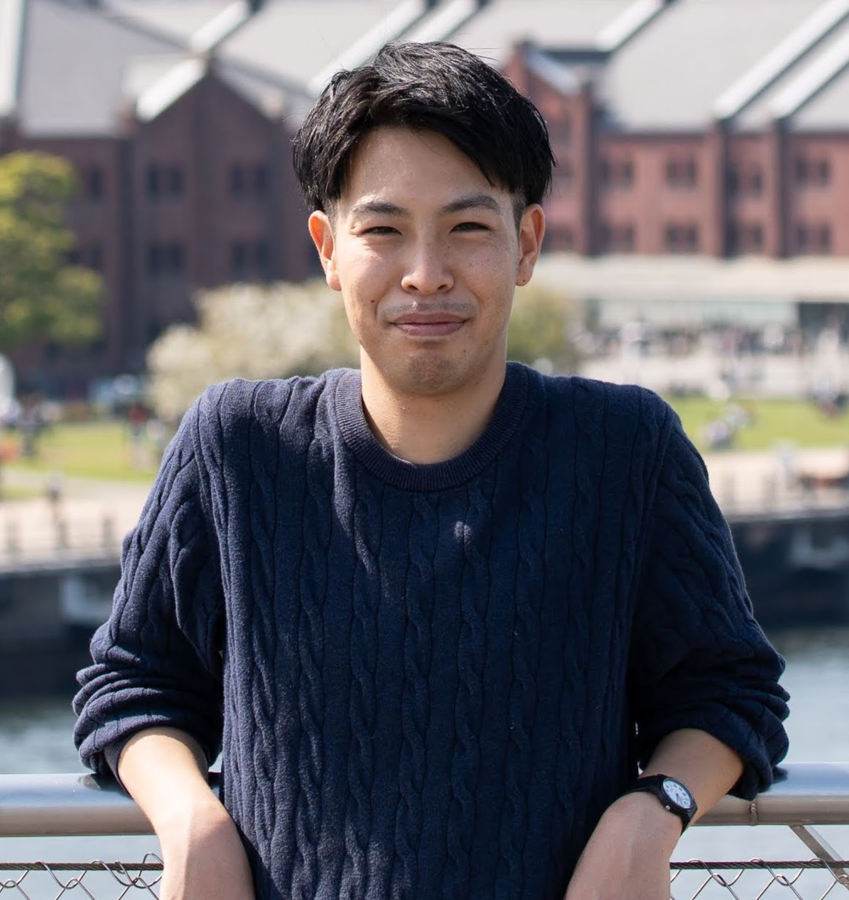

## About Me

Hello! I am a master's student majoring in information science at Nagoya University, Japan. I have also worked as a research intern at [CRAI-CIS lab](https://crai-cis.aalto.fi/), Aalto Universiy.

You can download my CV [here](CV_online.pdf)

## Research Interest

I’m broadly interested in natural language processing, computational social science, cultural analytics, AI bias and AI ethics. Combining these interests and my cultural background, I am especially curious about,
* how AI shape culture and culture shapes AI through training data, algorithms, and designs
* developing computational methods to better answer questions in social science disciplines
* using computational methods to answer questions in social science disciplines

## Conferences

Evaluating the Quality of Word Embedding Trained on Wikipedia Articles. Shintaro Sakai, Yasuhiro Suzuki. The 9th International Conference on Computational Social Science (**IC2S2 2023**).

Evaluating Semantic Changes in the Concept of Happiness with Diachronic Word Embeddings. Shintaro Sakai. The 9th International Conference on Computational Social Science (**IC2S2 2023**).

日本語単語埋め込みモデルにおけるジェンダーバイアスの評価(Evaluation of Gender Bias in Japanese Word Embedding Model). Shintaro Sakai, Yasuhiro Suzuki. The 37th Annual Conference of the Japanese Society for Artificial Intelligence (**JSAI 2023**).

Evaluation of Occupational Gender Bias in Japanese Word Embedding. Shintaro Sakai. 第2回計算社会科学会大会 (2023).

## Experience

The Cornell, Maryland, Max Planck Pre-doctoral Research School 2022. August 2022. [link](https://cmmrs2022.mpi-sws.org/)

Research Intern at [CRAI-CIS lab](https://crai-cis.aalto.fi/), Aalto Universiy. May – July 2022. 

Exchange program at St John's College, University of Cambridge. February 2019.

